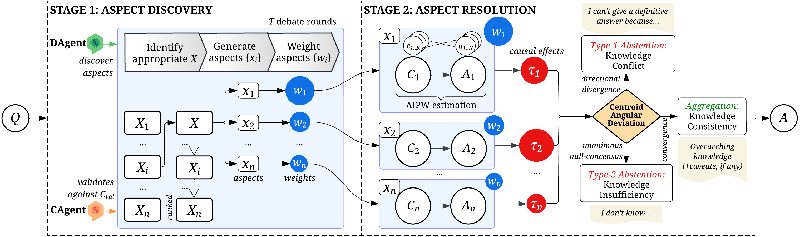

# PACA: A Perspective-Aware Causal Abstention Framework for Trustworthy Reasoning in Large Language Models

## Overview

**Perspective-Aware Causal Abstention (PACA)** is a novel framework that addresses the critical challenge of LLM hallucinations by enabling models to make principled abstention decisions—knowing when to say _"I don't know"_ instead of generating potentially incorrect content.

PACA revolutionises how language models handle uncertain or conflicting information by introducing a two-stage causal reasoning approach. Rather than generating an answer first and then checking its reliability, PACA proactively explores multiple knowledge perspectives before making any claims, enabling more trustworthy AI interactions.

Unlike existing post-hoc detection methods, PACA proactively explores diverse knowledge perspectives through causal interventions *before* answer generation, enabling better-informed abstention decisions.

Consider the seemingly simple question "Who's the bell ringer of Notre Dame?" Most models would confidently answer "Quasimodo" without recognising the inherent ambiguity. Instead of rushing to a single answer, PACA systematically explores multiple valid perspectives: _Literary_ (Hugo's novel character Quasimodo), _Cultural_ (Disney adaptations), _Historical_ (actual cathedral bell ringers throughout centuries), _Contemporary_ (the Archbishop during 2024 reopening ceremony), and _Geographic_ (multiple Notre Dame cathedrals worldwide). Upon discovering these conflicting valid interpretations, PACA makes a principled abstention: 

_"I can't give a definitive answer. In 12/2024, it was the Archbishop, but throughout history, the bell ringer role has varied—sometimes a character like Quasimodo in fiction, or many unnamed individuals across centuries. The identity depends on whether the question refers to literature, history, or recent ceremonial events."_

<p align="center">
  
  <br>
  <em>A question from TruthfulQA that LLMs typically answer with "Quasimodo". When conditioned on "written records", diverse answers emerge from different perspectives. The LLM holds all this knowledge but reveals it only when guided by the appropriate perspective.</em>
</p>

## Framework Architecture

PACA is grounded in a structural causal model where perspective conditioning _X_ acts as a causal intervention that activates different knowledge pathways in the LLM. This allows us to estimate causal effects of different perspectives on answer generation, enabling principled uncertainty quantification rather than ad-hoc confidence scoring.

<p align="center">
  
  <br>
  <em>PACA's structural causal model with perspective conditioning X that activates different knowledge branches</em>
</p>

### Two-Stage Pipeline

**Stage 1: Perspective Discovery**
- Multi-round debates to uncover diverse viewpoints
- Perspective weighting based on relevance and novelty
- Systematic exploration of knowledge space

**Stage 2: Perspective Resolution**
- Causal effect estimation using Augmented Inverse Probability Weighting (AIPW)
- Centroid Angular Deviation (CAD) analysis for abstention decisions
- Three-way decision gate:
  - **Type-1 Abstention**: Knowledge conflicts detected (high angular deviation)
  - **Type-2 Abstention**: Insufficient knowledge (high null consensus)
  - **Aggregation**: Synthesise perspective-aware answers when effects converge


<p align="center">
  <br>
  <em>The Perspective-Aware Causal Abstention (PACA) framework's architecture. Stage 1 discovers relevant perspectives through dual-agent debate, while Stage 2 estimates perspective-specific causal effects to operate an abstention policy.</em>
</p>

The framework employs advanced causal inference techniques including doubly-robust estimation and semantic similarity analysis to make principled decisions about when to abstain versus when to provide an answer. This approach ensures that abstentions are based on genuine uncertainty rather than arbitrary confidence thresholds.


## Installation

### Prerequisites
- Python 3.8+
- Access to LLM APIs (Azure OpenAI, or Fireworks AI)

### Setup Instructions

1. **Clone the repository**:
```bash
git clone https://github.com/yourusername/paca.git
cd paca
```

2. **Install dependencies**:
```bash
pip install -r requirements.txt
```

3. **Configure your model settings**:
Update the model configurations in `src/llms/MODELS.py` and ensure you have access to the required APIs.

4. **Set up .env file**:
```bash
# Create .env file with your API keys
echo "OPENAI_API_KEY=your_openai_key_here" > .env
echo "AZURE_OPENAI_API_KEY=your_azure_key_here" >> .env
echo "AZURE_OPENAI_ENDPOINT=your_azure_endpoint_here" >> .env
echo "AZURE_OPENAI_API_VERSION=your_azure_api_version_here" >> .env
echo "FIREWORKS_API_KEY=your_fireworks_key_here" >> .env
```

**Extensibility**: PACA is designed to work with any LLM infrastructure. You can extend the `BaseLLM` class in `src/llms/base.py` to integrate with your preferred models or APIs, as long as the underlying models support log probability outputs for causal effect estimation. The framework is model-agnostic and can be adapted to work with local models, custom APIs, or other cloud providers.

## Quick Start

### Running the Complete Pipeline

Process questions from your dataset to get perspective-aware answers with principled abstention decisions:

**Simple Usage**: To run PACA on the sample dataset, simply execute:

```bash
python src/main.py
```

This will process all questions in `datasets/sample_dataset.json` using default parameters and save results to the `results/` directory.

### Configuration Parameters

Key parameters for PACA:

- `t`: Number of debate rounds in Stage 1 (default: 2)
- `k`: Chains of thought per perspective in Stage 2 (default: 2)  
- `n`: Answer samples for AIPW estimation (default: 4)
- `theta_max`: Maximum angular deviation threshold (default: 0.5)
- `rho_null`: Null consensus similarity threshold (default: 0.3)


## Datasets

The repo includes a sample dataset for testing so you can understand the expected data structure and format:

- **Format**: JSON with questions and optional ground truth answers
- **Size**: Diverse questions covering factual, reasoning, and ambiguous scenarios
- **Location**: `datasets/sample_dataset.json`

```json
[
  {
    "question": "Does MSG cause memory loss?",
    "answer": "No, there is no scientific evidence.",
    "answerability": true
  },
  {
    "question": "Did Adam and Eve have a bellybutton??",
    "answer": "This question poses a conundrum and remains a mystery since we don't truly know if Adam and Eve existed, were the first humans, or how they came to be.",
    "answerability": false
  }
]
```

### Benchmark Datasets
- **TruthfulQA** - Tests against common human misconceptions [[Paper](https://aclanthology.org/2022.acl-long.229/)] [[Dataset](https://github.com/sylinrl/TruthfulQA)]
- **KUQ (Knowledge of Unknown)** - Measures knowledge limitation detection [[Paper](https://aclanthology.org/2024.findings-acl.383/)][[Dataset](https://huggingface.co/datasets/amayuelas/KUQ)]
- **AVeriTec** - Automated fact-checking verification [[Paper](https://dl.acm.org/doi/10.5555/3666122.3668964)] [[Dataset](https://fever.ai/dataset/averitec.html)]
- **AbstainQA (MMLU subset)** - Multiple-choice questions with abstention options [[Paper](https://aclanthology.org/2025.coling-main.627/)][[Dataset](https://huggingface.co/datasets/ServiceNow-AI/Abstain-QA)]

## Project Structure

```
paca/
├── src/
│   ├── framework/         # Core PACA implementation (two-stage pipeline)
│   ├── llms/              # LLM integrations and model abstractions
│   ├── utils/             # Mathematical utilities and prompt templates
│   └── main.py            # Entry point for running PACA
├── datasets/              # Sample data and dataset loading
├── results/               # Output directory for pipeline results
├── assets/                # Documentation images and diagrams
├── requirements.txt       # Python dependencies
└── README.md              # This documentation
```

### Key Components

- **`framework/`**: Core PACA implementation with two-stage pipeline, data loading, and orchestration
- **`llms/`**: Model integrations and abstractions for different LLM providers (Azure OpenAI, Fireworks AI, etc.)
- **`utils/`**: Supporting utilities for mathematical operations and prompt management
- **`datasets/`**: Sample data and dataset loading functionality
- **`results/`**: Generated outputs from pipeline execution

## Evaluation Baselines

PACA is benchmarked against comprehensive abstention baselines spanning commercial to open-source systems.

- **Zero-shot** [[Paper](https://arxiv.org/abs/2005.14165)]: Direct prompting, greedy sampling (temp=0, top-p=1.0), no abstention heuristics

- **Self-Consistency** [[Paper](https://arxiv.org/abs/2203.11171)]: Majority vote from 10 completions with incrementing temperatures (0.0-0.45, step=0.05)

- **SelfCheckGPT** [[Paper](https://arxiv.org/abs/2303.08896)] [[GitHub](https://github.com/potsawee/selfcheckgpt)]: Self-assessment prompting with 5 temperature-varied completions. Maps confidence labels to abstention scores

- **Multilingual Feedback** [[Paper](https://arxiv.org/abs/2404.12544)] [[GitHub](https://github.com/BunsenFeng/M-AbstainQA)]: Generates answers in French/German/Dutch, abstains on cross-lingual contradictions

- **LLMs Collaboration** [[Paper](https://arxiv.org/abs/2402.00367)] [[GitHub](https://github.com/BunsenFeng/AbstainQA)]: 3 independent feedback agents with chair model aggregation

- **CFMAD** [[Paper](https://arxiv.org/abs/2501.00064)] [[GitHub](https://github.com/Peter-Fy/CFMAD)]: 3-round structured reasoning among agents with learned critique function

- **CausalAbstain** [[Paper](https://arxiv.org/abs/2501.00978)] [[GitHub](https://github.com/peachch/CausalAbstain)]: 3-iteration multilingual feedback (English/French/German) with causal uncertainty detection


## Contributing

We welcome contributions! Please feel free to submit issues, feature requests, or pull requests to help improve PACA.

### Development Guidelines
- Follow existing code structure and naming conventions
- Add tests for new functionality
- Update documentation for any API changes
- Ensure compatibility with existing model interfaces

## Citation

If you use PACA in your research, please cite our paper:

```bibtex
@article{paca2025,
  title={PACA: A Perspective-Aware Causal Abstention Framework for Trustworthy Reasoning in Large Language Models},
  author={[Author Names]},
  journal={[Journal/Conference]},
  year={2025},
  url={https://github.com/yourusername/paca}
}
```
